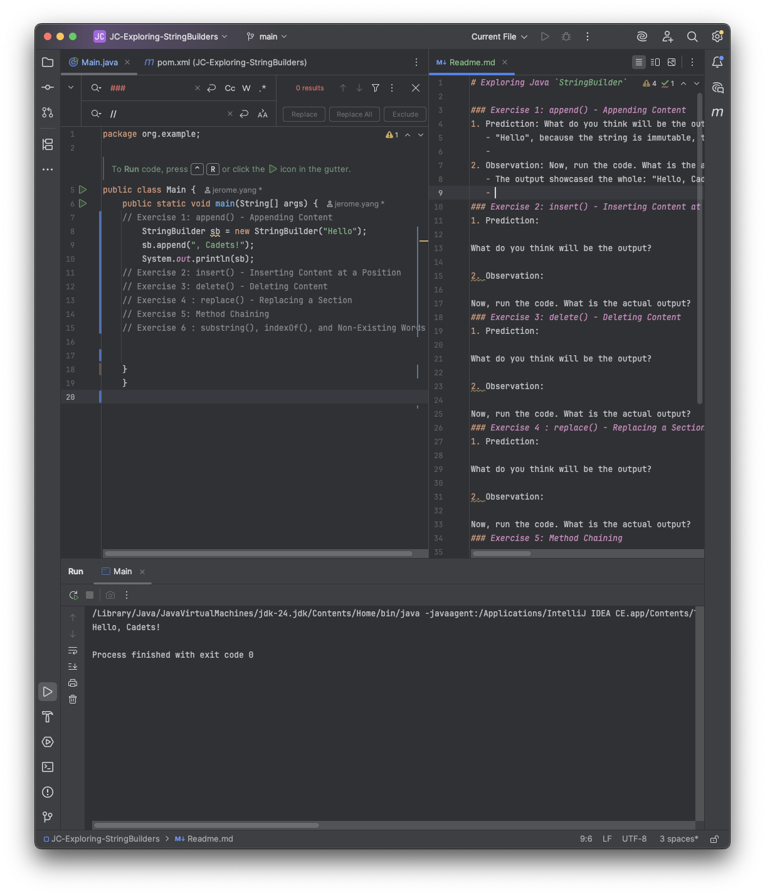
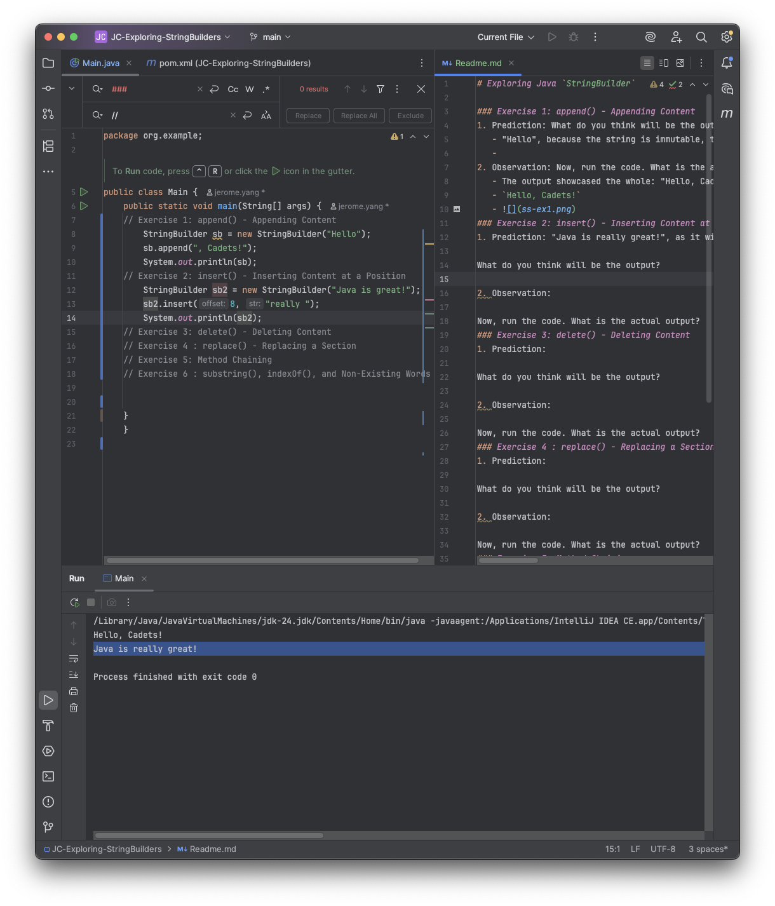
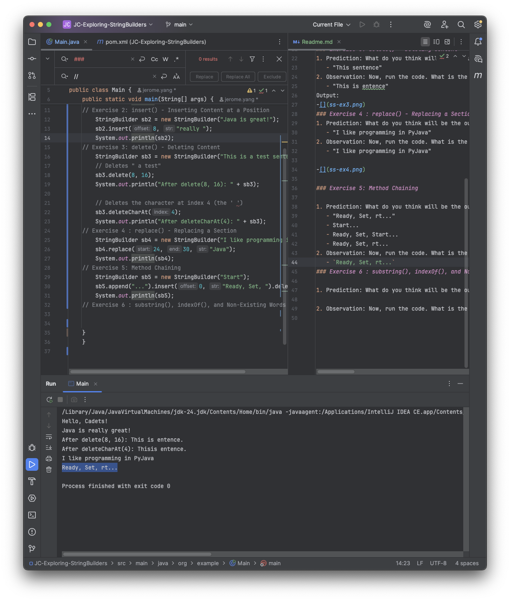
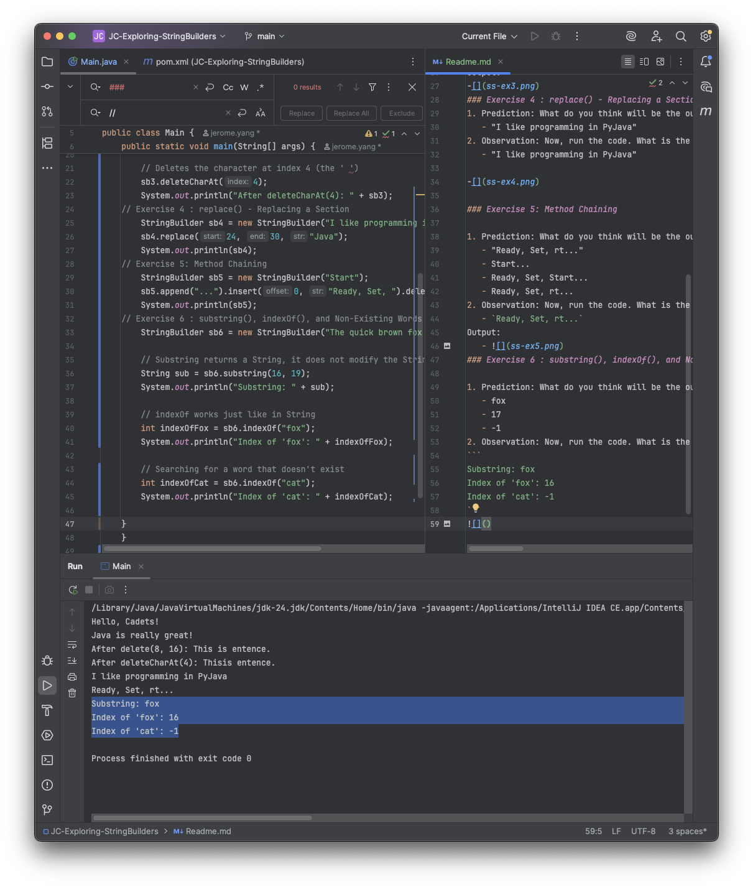

# Exploring Java `StringBuilder`

### Exercise 1: append() - Appending Content
1. Prediction: What do you think will be the output?
   - "Hello", because the string is immutable, the code line with concat did not reassign the string to variable sb, thus the reference to the string pool will still be "Hello"
   - 
2. Observation: Now, run the code. What is the actual output?
   - The output showcased the whole: "Hello, Cadets" because it was not a concat rather a append, meaning the array of chars was appended with new values
   - `Hello, Cadets!`
     Output:
   - 
### Exercise 2: insert() - Inserting Content at a Position
1. Prediction: "Java is really great!", as it will insert the string on the 8th index or `offset` of the array of chars in the object String

2. Observation: Now, run the code. What is the actual output?
  `Java is really great!`

  Output:
- 

### Exercise 3: delete() - Deleting Content
1. Prediction: What do you think will be the output?
   - "This sentence"
2. Observation: Now, run the code. What is the actual output?
   - "This is entence"
Output:
-[](ss-ex3.png)
### Exercise 4 : replace() - Replacing a Section
1. Prediction: What do you think will be the output?
   - "I like programming in PyJava"
2. Observation: Now, run the code. What is the actual output?
   - "I like programming in PyJava"

-[](ss-ex4.png)

### Exercise 5: Method Chaining

1. Prediction: What do you think will be the output?
   - "Ready, Set, rt..." 
   - Start...
   - Ready, Set, Start...
   - Ready, Set, rt...
2. Observation: Now, run the code. What is the actual output?
   - `Ready, Set, rt...`
Output:
   - 
### Exercise 6 : substring(), indexOf(), and Non-Existing Words

1. Prediction: What do you think will be the output?
   - fox
   - 17
   - -1
2. Observation: Now, run the code. What is the actual output?
```
Substring: fox
Index of 'fox': 16
Index of 'cat': -1
```
